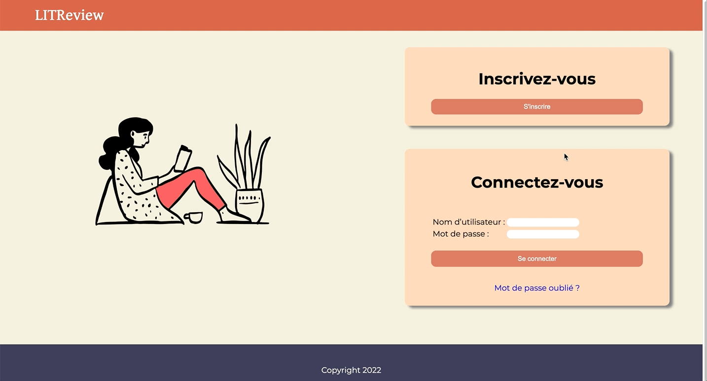
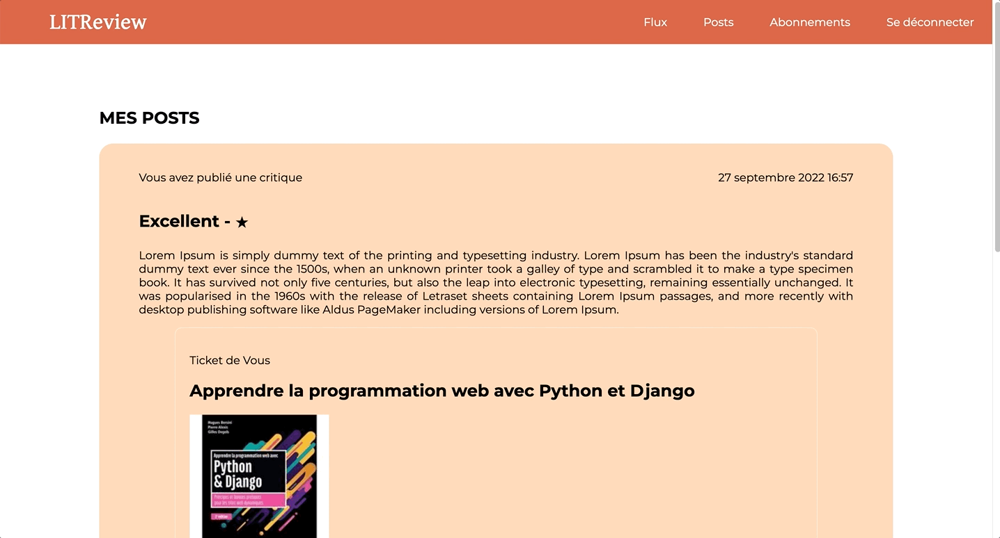

<div id="top"></div>

<!-- PROJECT SHIELDS -->
<!--
*** I'm using markdown "reference style" links for readability.
*** Reference links are enclosed in brackets [ ] instead of parentheses ( ).
*** See the bottom of this document for the declaration of the reference variables
*** for contributors-url, forks-url, etc. This is an optional, concise syntax you may use.
*** https://www.markdownguide.org/basic-syntax/#reference-style-links
-->
[![Contributors][contributors-shield]][contributors-url]
[![Forks][forks-shield]][forks-url]
[![Stargazers][stars-shield]][stars-url]
[![Issues][issues-shield]][issues-url]


<!-- PROJECT LOGO -->
<br />
<div align="center">

<h3 align="center">OC - PROJECT N°9 - Web Application Using Django Framework</h3>

  <p align="center">
   LITReview is a django web application allowing users to create or asked for books reviews.
    <br />
    <a href="https://github.com/Jliezed/oc_project_9_litreview">View Demo</a>
    ·
    <a href="https://github.com/Jliezed/oc_project_9_litreview/issues">Report Bug</a>
    ·
    <a href="https://github.com/Jliezed/oc_project_9_litreview/issues">Request Feature</a>
  </p>
</div>


<!-- TABLE OF CONTENTS -->
<details>
  <summary>Table of Contents</summary>
  <ol>
    <li>
      <a href="#about-the-project">About The Project</a>
      <ul>
        <li><a href="#built-with">Built With</a></li>
      </ul>
    </li>
    <li>
      <a href="#getting-started">Getting Started</a>
      <ul>
        <li><a href="#installation">Installation</a></li>
      </ul>
    </li>
    <li><a href="#contact">Contact</a></li>
  </ol>
</details>


<!-- ABOUT THE PROJECT -->
## About The Project

### Authentication



### CRUD
#### Create a Ticket

#### Create a Review

#### Update a post

#### Delete a post



### Followers


<p align="right">(<a href="#top">back to top</a>)</p>


### Built With

* HTML
* CSS & SASS
* Python - Django Framework

<p align="right">(<a href="#top">back to top</a>)</p>


<!-- GETTING STARTED -->
## Getting Started

### Installation & Running the script

1. Clone the repo
   ```sh
   git clone https://github.com/Jliezed/oc_project_9_litreview.git
   ```

#### Create and activate a virtual environment
2. Go to your project directory
   ```sh
   cd litreview
   ```
3. Install venv library (if not yet in your computer)
   ```sh
   pip install venv
   ```
4. Create a virtual environment
   ```sh
   python -m venv env
   ```
5. Activate the virtual environment
   ```sh
   source env/bin/activate
   ```
#### Install packages
6. Install the packages using requirements.txt
   ```sh
   pip install -r requirements.txt
   ```
#### Set environment variables
7. Create a copy of the file ".env.default" and rename it ".env"
8. Set value to the .env file:
   1. Define a secret key
   2. Debug to True for local development or False for production
   3. Allowed host equal to 127.0.0.1 for local environment

      ```sh
      SECRET_KEY='YOUR SECRET KEY'
      DEBUG=True
      ALLOWED_HOSTS=['127.0.0.1']
      ```

#### Create a superuser
9. Configure a superuser access
   ```sh
   python manage.py createsuper
   ```

#### Run the server
9. Get access to the app
   ```sh
   python manage.py runserver
   ```
---
---


<p align="right">(<a href="#top">back to top</a>)</p>


<!-- CONTACT -->
## Contact

Jliezed

Project Link: [https://github.com/Jliezed/oc_project_9_litreview](https://github.com/Jliezed/oc_project_9_litreview)

<p align="right">(<a href="#top">back to top</a>)</p>


<!-- MARKDOWN LINKS & IMAGES -->
<!-- https://www.markdownguide.org/basic-syntax/#reference-style-links -->
[contributors-shield]: https://img.shields.io/github/contributors/Jliezed/oc_project_9_litreview.svg?style=for-the-badge
[contributors-url]: https://github.com/Jliezed/oc_project_9_litreview/graphs/contributors
[forks-shield]: https://img.shields.io/github/forks/Jliezed/oc_project_9_litreview.svg?style=for-the-badge
[forks-url]: https://github.com/Jliezed/oc_project_9_litreview/network/members
[stars-shield]: https://img.shields.io/github/stars/Jliezed/oc_project_9_litreview.svg?style=for-the-badge
[stars-url]: https://github.com/Jliezed/oc_project_9_litreview/stargazers
[issues-shield]: https://img.shields.io/github/issues/Jliezed/oc_project_9_litreview.svg?style=for-the-badge
[issues-url]: https://github.com/Jliezed/oc_project_9_litreview/issues
[license-shield]: https://img.shields.io/github/license/Jliezed/oc_project_9_litreview.svg?style=for-the-badge
[license-url]: https://github.com/Jliezed/oc_project_9_litreview/blob/master/LICENSE.txt
[linkedin-shield]: https://img.shields.io/badge/-LinkedIn-black.svg?style=for-the-badge&logo=linkedin&colorB=555
[linkedin-url]: https://linkedin.com/in/linkedin_username
[product-screenshot]: images/screenshot.png
